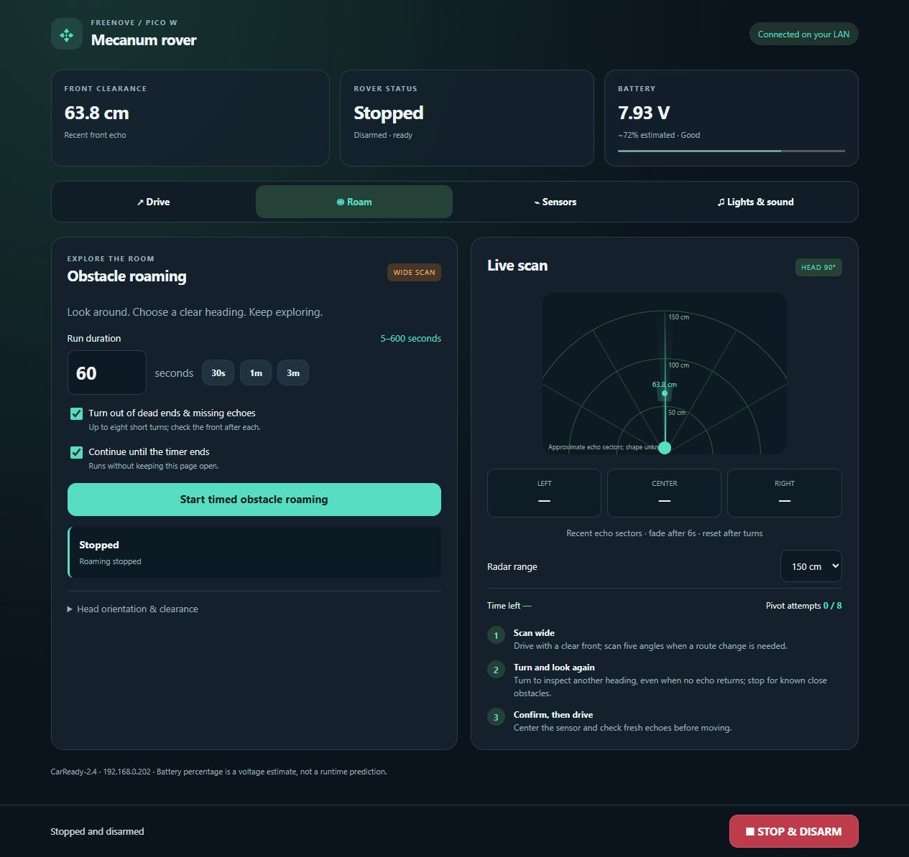
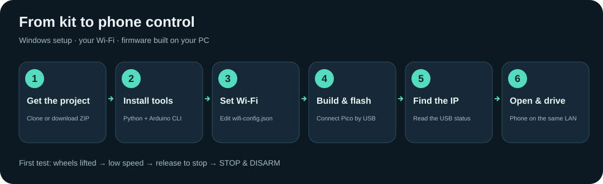
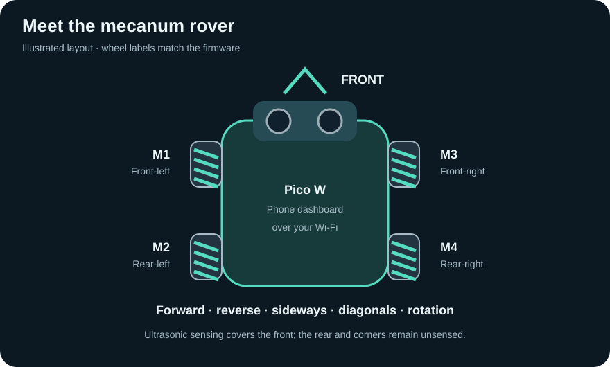

# 🤖 Freenove Pico W Mecanum Rover

CarReady **2.4** turns the Freenove FNK0089 mecanum car into a Wi-Fi rover with a phone dashboard, physical remote control, sensor-assisted driving, RGB effects and sound alerts. The dashboard runs on the Pico W itself; the PC is needed for setup and flashing only.

**📱 Control from your phone · 🛞 Move in any direction · 📡 Scan obstacles · 🌈 Lights & sound**



*Real dashboard screenshot from the tested car. The IP address and sensor readings shown are examples; yours will differ.*

## 🚀 Start here

New to Pico projects? Follow the [Windows setup below](#easy-setup), then try [your first drive](#first-drive). The firmware starts with the wheels stopped; you decide when to arm it.



> **What you need:** an assembled Freenove FNK0089 mecanum car with **Pico W**, a USB **data** cable, the kit battery pack, a Windows PC and a **2.4 GHz Wi-Fi** network. Fit the ultrasonic module for automatic driving. A charging-only cable cannot flash the Pico.

## ✨ Features

- Mecanum manual driving: forward, reverse, crab walks, diagonals and rotation.
- Timed obstacle roaming with a servo-mounted ultrasonic sensor, five-angle scans and heading recovery when echoes are missing.
- Live radar with distance labels, approximate echo sectors and selectable 100/150/300 cm range.
- Black-line and flashlight following, with configurable sensor polarity and light baseline.
- Battery voltage, approximate charge level, sensor readings and individual wheel activity.
- Chassis RGB colors, rainbow/chase/breathing effects, stationary party mode and a lifted-wheel show.
- Buzzer tones, a short melody, approximate loudness adjustment and distinct alerts.
- Stop/disarm, command expiry, an independent roaming deadline and watchdog recovery.
- Automatic detection of either the ultrasonic front module or the LED matrix, without reflashing.

## 🧰 Hardware

Freenove **FNK0089**, **Raspberry Pi Pico W**, mecanum roller wheels and the kit's battery pack. Wi-Fi needs a compatible **2.4 GHz** network. The supplied IR remote is supported; see [the short remote guide](REMOTE-GUIDE.md).



<details>
<summary><strong>🔌 GPIO reference for wiring and troubleshooting</strong></summary>

| Component | Pico GPIO |
|---|---|
| Motor 1: front-left | 18 / 19 |
| Motor 2: rear-left | 21 / 20 |
| Motor 3: front-right | 7 / 6 |
| Motor 4: rear-right | 9 / 8 |
| Servo | 13 |
| Ultrasonic trigger / echo | 4 / 5 |
| LED matrix SDA / SCL | 4 / 5; I2C address 0x71 |
| Chassis RGB LEDs | 16 |
| Buzzer / IR receiver | 2 / 3 |
| Battery ADC | 26 |
| Left / right light sensors | 28 / 27 |
| Left / center / right line sensors | 12 / 11 / 10 |

</details>

The ultrasonic module and matrix share the front connector and cannot operate there together. Automatic driving requires the ultrasonic module.

<a id="easy-setup"></a>

## 🛠️ Easy setup (Windows)

The steps below use **PowerShell**. Copy one command block at a time. Tested with Python 3.10+, Arduino CLI and Arduino-Pico **6.2.0**. The LED and remote libraries are already included—no separate library download is needed.

### 1️⃣ Download the project

If Git is installed:

```powershell
git clone https://github.com/smartboy223/Freenove-4WD-Mecanum-rover.git
Set-Location Freenove-4WD-Mecanum-rover
```

**Without Git:** select **Code → Download ZIP** on GitHub, extract it, open the extracted project folder and choose **Open in Terminal**. You should see `README.md`, `build.ps1` and `wifi-config.example.json` in that folder.

### 2️⃣ Install the two tools

- Install [Python for Windows](https://www.python.org/downloads/windows/). Enable its **Add Python to PATH** option if offered.
- Install [Arduino CLI](https://arduino.github.io/arduino-cli/latest/installation/) and make `arduino-cli` available on PATH.

Open a **new PowerShell window** after installation, return to the project folder and check:

```powershell
python --version
arduino-cli version
```

Both commands should print a version. If either is not recognized, finish that tool's PATH setup before continuing.

### 3️⃣ Install Pico support

```powershell
arduino-cli config add board_manager.additional_urls https://github.com/earlephilhower/arduino-pico/releases/download/global/package_rp2040_index.json
arduino-cli core update-index
arduino-cli core install rp2040:rp2040@6.2.0
python -m pip install -r requirements.txt
```

This installs the Pico compiler and Python's USB connection library. The initial download can take a few minutes. These commands follow the [Arduino-Pico installation guide](https://arduino-pico.readthedocs.io/en/latest/install.html).

### 4️⃣ Enter your Wi-Fi details

Create the local configuration **once**:

```powershell
Copy-Item wifi-config.example.json wifi-config.json
notepad wifi-config.json
```

Replace the two placeholders with your own **2.4 GHz Wi-Fi** name and password, then save:

```json
{
  "ssid": "Your Wi-Fi name",
  "password": "Your Wi-Fi password"
}
```

Keep the quotation marks and comma. If your password contains a quotation mark or backslash, JSON requires escaping it as `\"` or `\\`. Do not recreate the file when updating firmware; keep your existing settings.

🔒 `wifi-config.json` and the generated credentials header are excluded from Git. Your compiled UF2 also contains your Wi-Fi details, so each person should build their own firmware locally.

### 5️⃣ Build the firmware

```powershell
powershell -NoProfile -ExecutionPolicy Bypass -File .\build.ps1
```

Wait for a successful build with no red error messages. Your firmware will be at **`build\CarReady.ino.uf2`**. This command's execution-policy setting applies only to that PowerShell process.

### 6️⃣ Flash the Pico W

**First installation or a Pico that is not responding:**

1. Keep all four wheels clear of the ground. Turn the car's battery switch **OFF**.
2. Disconnect USB. Hold the Pico's **BOOTSEL** button while reconnecting USB to the PC.
3. Release BOOTSEL when the **RPI-RP2** drive appears in File Explorer.
4. Run:

   ```powershell
   .\Flash-Car.bat
   ```

The script verifies the Pico boot drive and copies your locally built firmware. The drive disappears as the Pico restarts; that is expected.

**Later updates, when the Pico already appears as a USB serial device:**

```powershell
arduino-cli board list
```

Find the Pico's port, then upload. **Replace `COM3` with your own port:**

```powershell
arduino-cli upload --fqbn rp2040:rp2040:rpipicow --port COM3 --input-dir build
```

### 7️⃣ Find your dashboard address

Allow roughly 20 seconds for Wi-Fi connection after flashing, then run:

```powershell
python car_tool.py STATUS
```

Look for `"wifi_connected":true` and `"ip":"192.168.x.x"`. Copy **your** IP address into the phone browser as **`http://YOUR-CAR-IP/`**. Keep the phone on the same main Wi-Fi network. The IP in the screenshot is only an example.

If USB lists more than one Pico, select the port explicitly, for example `python car_tool.py --port COM3 STATUS`.

✅ **Success looks like:** the page says **Connected on your LAN**, the rover is **Stopped**, and sensor/battery cards appear. The kit battery switch must be on for powered motor and sensor checks; keep the car lifted for the first tests.

<a id="first-drive"></a>

### 🎮 Your first drive

1. Open **Drive** and leave the front obstacle guard checked.
2. Select a low speed, then press **Arm manual controls**.
3. Hold one direction briefly. Release it—the wheels should stop.
4. Check forward, reverse, crab left/right and rotation while the wheels remain lifted.
5. Press **STOP & DISARM** before placing the car on a clear, level floor.

The Pico hosts the dashboard. After setup, it can run on its battery without the PC; the phone still needs access to the same Wi-Fi network.

## 📱 Connect from your phone

Run `python car_tool.py STATUS` to find the Pico's current `ip`. On a phone connected to the same main Wi-Fi/LAN, open `http://<car-ip>/`. For example, this installation currently uses `http://192.168.0.202/`. Use **HTTP** and reload after a firmware update.

The Pico serves the dashboard directly on port 80. DHCP may change its address; a router reservation keeps it stable. `http://freenove-car.local/` is also advertised, where the phone/router supports local name resolution. Guest-network or mesh client isolation can block phone access even when the PC can reach the car. This dashboard is intended for the local network.

## 🛞 Driving modes

In **Drive**, select a low speed, keep **Front obstacle guard** enabled and arm manual controls. Hold a direction to move; release to stop. Crab arrows move sideways, corners move diagonally and curved arrows rotate. **STOP & DISARM** cancels every mode. The configured forward/backward correction preserves left/right crab and rotation; verify wheel direction while lifted after changing hardware.

The front guard stops forward movement below 25 cm, with uncertain echoes, or with the head off-center. Sideways, reverse and rotation are not covered by the front sensor.

### 📡 Obstacle roaming

In **Roam**, select 5–600 seconds and press **Start timed obstacle roaming**.

1. Check the centered sensor; advance when reliable front clearance is at least 35 cm.
2. Keep watching the front while moving. Stop to scan 30°, 60°, 90°, 120° and 150° at an obstacle, uncertain echo or periodic route check.
3. Prefer an open forward route or turn toward a measured clear side.
4. If no usable route echo exists and **Turn out of dead ends & missing echoes** is enabled, turn in short steps to inspect other headings. Keep the same direction rather than oscillating. Stop and check fresh front readings after each step; repeat the wide scan after four unsuccessful inspection turns.
5. Resume forward travel only after a reliable clear front reading. Stop/disarm after eight unsuccessful turns or at the selected timer deadline.

Inspection turns last 450 ms at up to 25%; measured-exit turns last 500 ms and measured dead-end pivots 350 ms. A known echo below 18 cm blocks a turn, and a newly detected close echo interrupts one already in progress. Missing echoes can mean open space, an unsuitable surface or a failed sensor; they never authorize forward travel. Turn angles are timed estimates, so the car may inspect the opposite side but cannot guarantee a precise 180° turn. The rear/corners remain unsensed. Use an open, level area away from edges and stairs.

**Continue until the timer ends** runs the selected timer on the Pico without keeping the page open. Wi-Fi loss, low battery, Stop and watchdog expiry still stop the car. A hardware timer enforces the overall deadline independently of HTTP requests.

Radar points represent recent sensor measurements, not a room map or object shape. They fade after six seconds and clear after a chassis turn.

### 🔦 Line and flashlight following

- **Line:** place a continuous black strip beneath the three underside sensors on a light surface. This installation's center-only black fixture reads `[1,0,1]`, so **black reads 0** is the default. Change polarity in **Sensors** if your hardware differs. Centered patterns drive all four wheels straight; side patterns apply gentle corrections. All-black stops; a white gap is crossed for at most 500 ms before stopping.
- **Flashlight:** set the ambient baseline in **Sensors** with the flashlight off, then aim it at the front photoresistors. Adjust sensitivity for your room. No bright target means stopped.

Keep the dashboard visible for line/light modes. Real floor tracking and stopping distance depend on surface, battery, speed and sensor height.

## 🌈 Lights, sound and swapping modules

**Lights & sound** offers RGB colors, effects, brightness, party mode, test tones from 400–3000 Hz and a six-note chime. Loudness controls GPIO duty cycle; it is approximate rather than amplifier volume. Zero mutes all sound. Movement alerts can be toggled separately. Stationary party and melody commands stop driving first.

The ten-second crab/spin demonstration requires acknowledgement that all four wheels are lifted. It finishes stopped and disarmed.

To swap the front module: switch the car off, unplug USB, fit the ultrasonic sensor or matrix in the vendor orientation, then restore power. A response at I2C address 0x71 selects matrix mode; otherwise ultrasonic mode is selected. Check the dashboard or `Check-Car.bat`. An absent module can also select ultrasonic mode, so selection alone does not prove successful ranging.

## 🧪 Checks and diagnostics

| Command | Purpose |
|---|---|
| `python car_tool.py STATUS` | USB sensor/controller status |
| `python car_tool.py STOP` | Stop/disarm |
| `python car_tool.py --verify` | USB checks without wheel motion |
| `./test.ps1` | Actual roaming state machine and policy tests on the PC |
| `python control_check.py --host <car-ip> --lifted` | Live LAN controls, wheel patterns, timed roaming and show |
| `python studio_check.py` | Stopped-car sound/head checks |
| `python lan_check.py` | HTTP compatibility checks |
| `python http_recovery_check.py` | Stopped-car HTTP stress and intentional watchdog restart |
| `python recovery_check.py --lifted` | Live fault-injection test: two turns with echoes suppressed, then restore the real sensor |

Live tests write local JSON evidence, excluded from the repository. Scripts other than `control_check.py` and `recovery_check.py` currently use this installation's default address/COM3; change their HOST/BASE/port for another setup. The native C++ tests use g++ or Visual Studio C++ Build Tools. See [validation notes](docs/VALIDATION.md) for current results and limits.

The USB recovery diagnostic requires the exact command `TESTNOECHO LIFTED`. It intentionally suppresses filtered echoes until two turns complete, then restores real sonar readings; an independent 15-second deadline ends the test. Stop, reset and watchdog recovery clear the diagnostic. It is a lifted-wheel test, not a floor-navigation certification.

## 📂 Project layout

```text
firmware/CarReady/       Firmware, motion/sensing policies, roaming controller and dashboard
project-libraries/      Required third-party libraries and licenses
tests/                 PC tests of the production controller and policies
build.ps1               Generate dashboard/credentials and compile
prepare_wifi.py         Read local Wi-Fi settings without logging credentials
prepare_dashboard.py    Embed the dashboard HTML in firmware
car_tool.py             USB setup/status/Stop commands
recovery_check.py        Lifted-car heading-recovery test
prepare_repo.py         Prepare a clean repository copy without local secrets/artifacts
REMOTE-GUIDE.md          Short physical-remote guide
wifi-config.example.json Example settings only
```

## 🤝 Development and contributions

Found an issue or tried a different setup? [Open an issue](https://github.com/smartboy223/Freenove-4WD-Mecanum-rover/issues) with your board model, firmware version and steps to reproduce. Keep Wi-Fi passwords out of screenshots and reports. Changes to driving logic should include the PC controller checks and a lifted-wheel check before floor testing.

`prepare_repo.py` is a local packaging helper for preparing a separate clean copy from a working hardware folder. It excludes credentials, compiled firmware, private backups, downloaded archives and hardware logs. It does not publish to GitHub or modify an existing repository checkout. Normal users can work directly in their clone.

Keep the original licenses with vendored code; see [third-party notices](THIRD-PARTY.md).

## 🆘 Troubleshooting

| Problem | Try this |
|---|---|
| `python` or `arduino-cli` is not recognized | Check PATH, reopen PowerShell and retry the version commands. |
| Python cannot find `serial` | Run `python -m pip install -r requirements.txt` with the same Python used by the scripts. |
| `RPI-RP2` does not appear | Use a USB data cable; unplug, hold BOOTSEL and reconnect. |
| Build reports invalid Wi-Fi settings | Check the JSON syntax and replace both placeholders. Use your 2.4 GHz network. |
| USB tool reports no Pico or no response | Close Arduino Serial Monitor, check the cable/port and use `--port COMx` if needed. |
| Phone cannot open the dashboard | Use the IP reported by STATUS, use `http://`, check Wi-Fi connection and avoid guest/client-isolated networks. |
| Dashboard works but motors do not | Check the kit batteries and power switch; arm controls and check the front guard/readings. |
| Roaming keeps turning and then stops | Missing echoes never authorize forward travel. Check the sensor/connector and try a flat target; recovery stops after eight unsuccessful turns. |
| Line following is incorrect | Check line sensor height and black/white polarity in Sensors, then verify a centered strip while lifted. |
| Dashboard looks old after an update | Refresh it or open a new browser tab. |

## 🔗 References

- [Freenove FNK0089 mecanum assembly guide](https://docs.freenove.com/projects/fnk0089/en/latest/fnk0089/codes/Mecanum/1_Assembling_Smart_Car.html)
- [Official Freenove Pico kit resources](https://github.com/Freenove/Freenove_4WD_Car_Kit_for_Raspberry_Pi_Pico)
- [Arduino-Pico installation and USB recovery](https://arduino-pico.readthedocs.io/en/latest/install.html)
