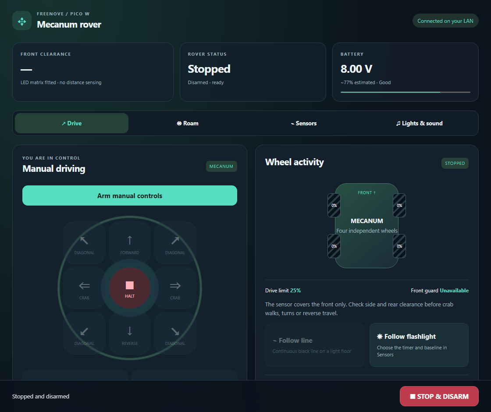
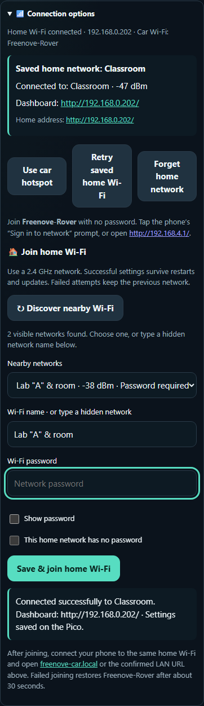
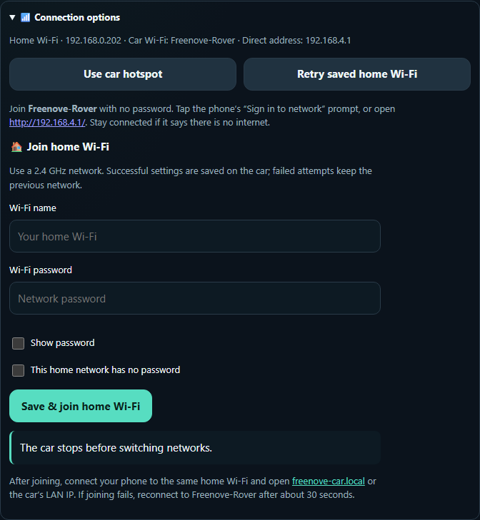
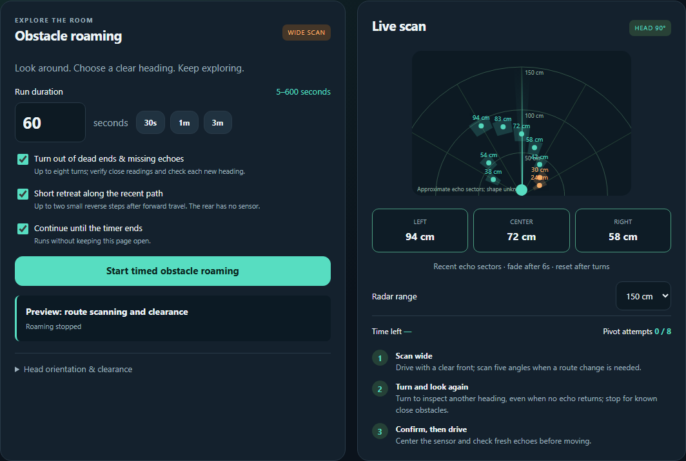
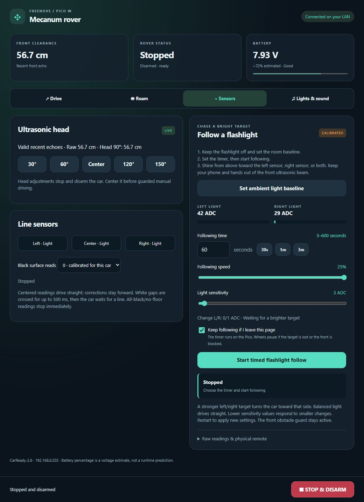
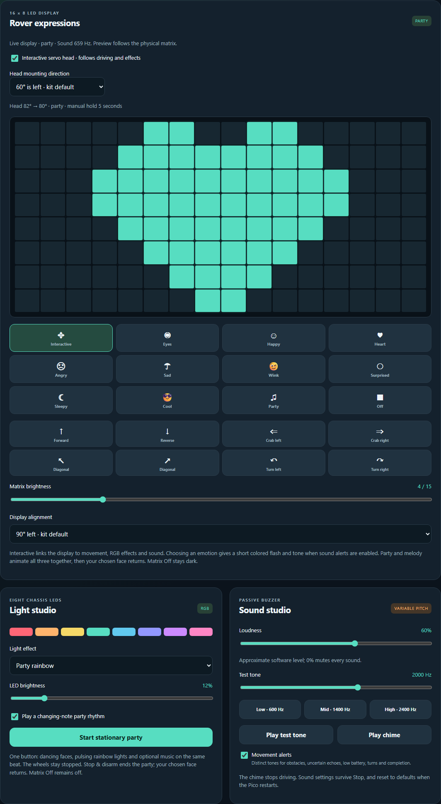
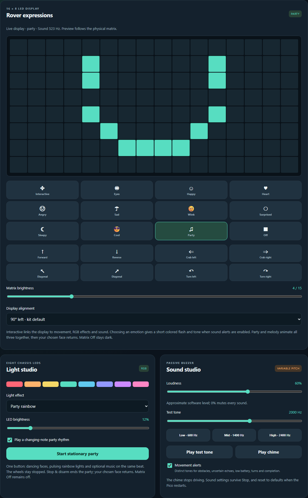

# 🤖 Freenove Pico W Mecanum Rover

CarReady **2.11** turns the Freenove FNK0089 mecanum car into a Wi-Fi rover with a phone dashboard, physical remote control, sensor-assisted driving, animated matrix expressions, RGB effects and sound alerts. The dashboard runs on the Pico W itself; after the first USB installation, firmware updates can also use home Wi-Fi or the car's own open development hotspot.

**📱 Control from your phone · 🛞 Move in any direction · 📡 Scan obstacles · 🌈 Lights & sound**



*Current dashboard preview with demonstration readings. The dashboard is served directly by the Pico W; your IP address and readings will differ.*

**[🚀 Setup](#easy-setup) · [🎮 First drive](#first-drive) · [📱 Phone connection](#phone-connection) · [🌈 Matrix & party](#matrix-and-party) · [🆘 Help](#troubleshooting)**

## 🚀 Start here

New to Pico projects? Follow the [Windows setup below](#easy-setup), then try [your first drive](#first-drive). The firmware starts with the wheels stopped; you decide when to arm it.


> **What you need:** an assembled Freenove FNK0089 mecanum car with **Pico W**, a USB **data** cable, the kit battery pack and a Windows PC. Use your **2.4 GHz home Wi-Fi** or the car's own **Freenove-Rover** hotspot. Internet is needed to download the tools; driving works locally afterwards. A charging-only cable cannot flash the Pico.

### 🔄 Choose your front module

The kit's front connector accepts **one module at a time**. Pick the experience you want:

| What you want to try | Ultrasonic sensor | LED matrix |
|---|:---:|:---:|
| Phone/remote manual driving, crab walks and rotation | ✅ | ✅ |
| RGB lights, buzzer and stationary party | ✅ | ✅ |
| Distance readings, radar and front obstacle guard | ✅ | — |
| Timed obstacle roaming, line and flashlight following | ✅ | — |
| Faces, hearts, movement signs and animated servo head | — | ✅ |

**Switch off the car and disconnect USB before swapping modules**, then reboot so the firmware detects the new module. No reflashing is needed. The matrix has no distance sensing; manual driving stays available with its front guard disabled automatically.

## ✨ Features

- Mecanum manual driving: forward, reverse, crab walks, diagonals and rotation.
- Phone-friendly circular driving pad: hold to move, slide between directions, release to stop; dedicated crab and turn controls.
- LED matrix expressions: happy, heart, angry, sad, wink, surprised, sleepy, cool, party and blinking eyes, plus interactive movement arrows and adjustable brightness.
- Password-protected Wi-Fi firmware updates during a short, stopped maintenance window.
- Open car hotspot at **192.168.4.1** when home Wi-Fi is unavailable, with dashboard controls for switching networks.
- Timed obstacle roaming with a servo-mounted ultrasonic sensor, five-angle scans, retained-direction turns and short recent-path retreats.
- Live radar with distance labels, approximate echo sectors and selectable 100/150/300 cm range.
- Black-line following and independently timed flashlight following, with left/right steering, straight travel and a calibrated room baseline.
- Battery voltage, approximate charge level, sensor readings and individual wheel activity.
- Chassis RGB colors, rainbow/chase/breathing effects, stationary party mode and a lifted-wheel show.
- Buzzer tones, a short melody, approximate loudness adjustment and distinct alerts.
- Stop/disarm, command expiry, an independent roaming deadline and watchdog recovery.
- Automatic detection of either the ultrasonic front module or the LED matrix, without reflashing.

## 🧰 Hardware

Freenove **FNK0089**, **Raspberry Pi Pico W**, mecanum roller wheels and the kit's battery pack. Wi-Fi needs a compatible **2.4 GHz** network. The supplied IR remote is supported; see [the short remote guide](REMOTE-GUIDE.md).


Before flashing, check the [official FNK0089 assembly guide](https://docs.freenove.com/projects/fnk0089/en/latest/fnk0089/codes/Mecanum/1_Assembling_Smart_Car.html): fit the wheel types **A–B–A–B in M1 → M4 order**, check the Pico W socket orientation, center the servo at **90° before fitting its horn**, and follow the kit's battery polarity markings. These details matter for sideways movement and scanning.

<details>
<summary><strong>🔌 GPIO reference for wiring and troubleshooting</strong></summary>

| Component | Pico GPIO |
|---|---|
| Motor 1: front-left | 18 / 19 |
| Motor 2: rear-left | 21 / 20 |
| Motor 3: front-right | 7 / 6 |
| Motor 4: rear-right | 9 / 8 |
| Servo | 13 |
| Ultrasonic trigger / echo | 4 / 5 |
| LED matrix SDA / SCL | 4 / 5; I2C address 0x71 |
| Chassis RGB LEDs | 16 |
| Buzzer / IR receiver | 2 / 3 |
| Battery ADC | 26 |
| Left / right light sensors | 28 / 27 |
| Left / center / right line sensors | 12 / 11 / 10 |

</details>

The ultrasonic module and matrix share the front connector and cannot operate there together. Manual driving works with either module. With the matrix fitted, the obstacle guard is unavailable and is disabled automatically; the dashboard labels this explicitly. Guarded automatic driving requires the ultrasonic module.

<a id="easy-setup"></a>

## 🛠️ Easy setup (Windows)

The steps below use **PowerShell**. Copy one command block at a time. Tested with Python 3.10+, Arduino CLI and Arduino-Pico **6.2.0**. The LED and remote libraries are already included—no separate library download is needed.

### 1️⃣ Download the project

If Git is installed:

```powershell
git clone https://github.com/smartboy223/Freenove-Pico-W-Mecanum-Rover.git
Set-Location Freenove-Pico-W-Mecanum-Rover
```

**Without Git:** select **Code → Download ZIP** on GitHub, extract it, open the extracted project folder and choose **Open in Terminal**. You should see `README.md`, `build.ps1` and `wifi-config.example.json` in that folder.

### 2️⃣ Install the two tools

- Install [Python for Windows](https://www.python.org/downloads/windows/). Enable its **Add Python to PATH** option if offered.
- Install [Arduino CLI](https://arduino.github.io/arduino-cli/latest/installation/) and make `arduino-cli` available on PATH.

Open a **new PowerShell window** after installation, return to the project folder and check:

```powershell
python --version
arduino-cli version
```

Both commands should print a version. If either is not recognized, finish that tool's PATH setup before continuing.

### 3️⃣ Install Pico support

```powershell
arduino-cli config add board_manager.additional_urls https://github.com/earlephilhower/arduino-pico/releases/download/global/package_rp2040_index.json
arduino-cli core update-index
arduino-cli core install rp2040:rp2040@6.2.0
python -m pip install -r requirements.txt
```

This installs the Pico compiler and Python's USB connection library. The initial download can take a few minutes. These commands follow the [Arduino-Pico installation guide](https://arduino-pico.readthedocs.io/en/latest/install.html).

### 4️⃣ Enter your Wi-Fi details

Choose **home Wi-Fi now** or **pair later through the car hotspot**. Both paths use a local configuration file. Create it **once**:

```powershell
Copy-Item wifi-config.example.json wifi-config.json
notepad wifi-config.json
```

**Option A — home Wi-Fi:** replace the two placeholders with your own **2.4 GHz Wi-Fi** name and password, then save:

```json
{
  "ssid": "Your Wi-Fi name",
  "password": "Your Wi-Fi password"
}
```

Keep the quotation marks and comma. If your password contains a quotation mark or backslash, JSON requires escaping it as `\"` or `\\`. Do not recreate the file when updating firmware; keep your existing settings.

**Option B — set up without a router:** use this deliberately unused network name instead:

```json
{
  "ssid": "Freenove-Setup-Only",
  "password": ""
}
```

After the first flash, wait about **30 seconds**, join **Freenove-Rover** on your phone, and open **http://192.168.4.1/**. You can drive locally or discover and save your home network in **Connection options**. A successful dashboard save takes precedence over this initial file and survives restarts and wireless updates.

🔒 `wifi-config.json` and the generated credentials header are excluded from Git. Your compiled UF2 also contains your Wi-Fi details, so each person should build their own firmware locally.

### 5️⃣ Build the firmware

```powershell
powershell -NoProfile -ExecutionPolicy Bypass -File .\build.ps1
```

Wait for a successful build with no red error messages. Your firmware will be at **`build\CarReady.ino.uf2`**. This command's execution-policy setting applies only to that PowerShell process.

### 6️⃣ Flash the Pico W

**First installation or a Pico that is not responding:**

1. Keep all four wheels clear of the ground. Turn the car's battery switch **OFF**.
2. Disconnect USB. Hold the Pico's **BOOTSEL** button while reconnecting USB to the PC.
3. Release BOOTSEL when the **RPI-RP2** drive appears in File Explorer.
4. Run:

   ```powershell
   .\Flash-Car.bat
   ```

The script verifies the Pico boot drive and copies your locally built firmware. The drive disappears as the Pico restarts; that is expected.

**Later updates, when the Pico already appears as a USB serial device:**

```powershell
arduino-cli board list
```

Find the Pico's port, then upload. **Replace `COM3` with your own port:**

```powershell
arduino-cli upload --fqbn rp2040:rp2040:rpipicow:flash=2097152_1048576 --port COM3 --input-dir build
```

### 7️⃣ Find your dashboard address

Allow roughly **20 seconds** for home Wi-Fi, or **30 seconds** for hotspot fallback. On Windows, double-click **start.bat**, or run:

```powershell
.\start.bat
```

It finds and opens the dashboard using USB status or known local addresses. You do not need to start a web server on the PC. For the address and connection details directly over USB:

```powershell
python car_tool.py STATUS
```

Look for `"wifi_connected":true` and `"ip":"192.168.x.x"`. Copy **your** IP address into the phone browser as **`http://YOUR-CAR-IP/`**. Keep the phone on the same main Wi-Fi network. The IP in the screenshot is only an example.

If USB lists more than one Pico, select the port explicitly, for example `python car_tool.py --port COM3 STATUS`.

✅ **Success looks like:** the page says **Connected on your LAN**, the rover is **Stopped**, and sensor/battery cards appear. The kit battery switch must be on for powered motor and sensor checks; keep the car lifted for the first tests.

<a id="first-drive"></a>

### 🎮 Your first drive

1. Open **Drive**. With the ultrasonic module, leave the front obstacle guard checked. With the matrix, the dashboard automatically disables the unavailable guard.
2. Open **⚙ Driving settings**, select a low speed, then press **Arm manual controls**.
3. Hold one direction briefly. Slide to another arrow to change direction; release or leave the pad to stop.
4. Check forward, reverse, crab left/right and rotation while the wheels remain lifted.
5. Press **STOP & DISARM** before placing the car on a clear, level floor.

The Pico hosts the dashboard. After setup, it can run on its battery without the PC; connect your phone through home Wi-Fi or directly to the car hotspot.

Double-click **start.bat** on Windows to find and open the dashboard. It checks the USB-reported address when a Pico is connected, then the last working address, this installation's LAN IP, the hotspot IP and `freenove-car.local`. It never flashes or starts the motors. An optional `start.bat --host YOUR-CAR-IP` works with another router address.

After an ordinary power cycle or restart, the Pico automatically tries its **saved home Wi-Fi** and serves the dashboard when connected. If home Wi-Fi is unavailable for 30 seconds, it starts **Freenove-Rover**. Choosing the hotspot applies to that session; the next ordinary restart tries home Wi-Fi again. An OTA update keeps the current connection for its completion check. The car always boots stopped/disarmed; select a drive mode when ready.

### 🧑‍🔬 Three first experiments

| Experiment | How to try it | What to look for |
|---|---|---|
| Mecanum movement | Lift the wheels, arm at low speed, briefly hold forward, crab and turn. | Crab moves sideways; rotation drives the two sides in opposite directions. Release stops the wheels. |
| Expressive robot | Fit the matrix, choose Heart, then start stationary party in Lights & sound. | Faces, chassis colors, sound and the optional servo head move together. Stop ends the show. |
| Sensor discovery | Fit ultrasonic; try a flat target 20–50 cm ahead. In Sensors, compare a centered black strip and light on each photoresistor. | Distance changes; the center line sensor differs from the outer pair; left/right light readings change independently. |

For line tests, hold white paper with black under **only the center sensor**, about **3–5 mm** below the sensor tips. For flashlight following, set the ambient baseline with the flashlight **off**, then aim from above while keeping your hands out of the ultrasonic beam. Begin actual floor trials at low speed on a clear, level surface.

### 📶 Later firmware updates over Wi-Fi

Install **2.8 or later by USB once** using the steps above. `build.ps1` allocates 1 MiB to the sketch and 1 MiB to the filesystem so a wireless update can be staged. It also creates a random update password in local **`ota-config.json`**. Keep that file together with your existing `wifi-config.json`; both stay outside Git.

For future updates, power the car, keep it stopped, and connect the PC to the same LAN:

```powershell
powershell -NoProfile -ExecutionPolicy Bypass -File .\build.ps1
python wireless_update.py --host 192.168.0.202
```

If the PC is connected directly to the car's hotspot, use `python wireless_update.py --host 192.168.4.1` instead. Edit the source and build on the PC, then upload over either connection. The dashboard is a controller, not a browser code editor. No internet connection is needed to use the local dashboard or upload a build once the tools are installed.

Replace the address with your car's current IP. The updater stops/disarms the wheels, opens a two-minute maintenance window, blocks driving, authenticates, transfers the local **`.bin`**, and confirms a stopped reboot. The listener closes afterwards. If Windows blocks the transfer, allow Python on your **private** network; the transfer uses Pico UDP 2040 and PC TCP 32382. USB/BOOTSEL remains available for recovery.

Do not delete or replace `ota-config.json` before an update: its password must match the one already installed. A deliberate password change needs one USB installation. The locally built `.bin` and `.uf2` contain your private settings and should stay unpublished. This follows the [Arduino-Pico wireless update support](https://arduino-pico.readthedocs.io/en/latest/ota.html).

<a id="phone-connection"></a>

## 📱 Connect from your phone

Run `python car_tool.py STATUS` to find the Pico's current `ip`. On a phone connected to the same main Wi-Fi/LAN, open `http://<car-ip>/`. For example, this installation currently uses `http://192.168.0.202/`. Use **HTTP** and reload after a firmware update.

The Pico serves the dashboard directly on port 80. DHCP may change its address; a router reservation keeps it stable. `http://freenove-car.local/` is also advertised, where the phone/router supports local name resolution. Guest-network or mesh client isolation can block phone access even when the PC can reach the car. This dashboard is intended for the local network.

### 🚙 Direct car Wi-Fi: no router required

Firmware **2.11** provides an open development network named **Freenove-Rover**. No Wi-Fi password is needed. If the saved home network cannot connect, this hotspot starts after **30 seconds**. Choosing **Use car hotspot** starts it directly for the current session. Normal restarts try saved home Wi-Fi again; an OTA update preserves the current network for its completion check.

1. In **Connection options**, choose **Use car hotspot**, or use `python car_tool.py WIFI HOTSPOT` from USB.
2. On your phone, join **Freenove-Rover** without a password. Stay connected when the phone says there is no internet.
3. Tap the phone's **Sign in to network** notification, or open **[http://192.168.4.1/](http://192.168.4.1/)** directly. Local DNS and the common Android, Apple and Windows connection probes lead to the dashboard, following [Arduino-Pico's captive portal approach](https://github.com/earlephilhower/arduino-pico/blob/master/libraries/DNSServer/examples/CaptivePortal/CaptivePortal.ino). Automatic opening depends on the phone; the direct address always remains available on this Wi-Fi.

### 🏠 Pair with home Wi-Fi from the dashboard

Tap the connection badge at the top to jump to **Connection options**. The panel shows the **saved home network**, **actual connected network**, **signal strength** and a clickable **dashboard URL**. It opens automatically on the car hotspot.

Choose **Discover nearby Wi-Fi**, select your visible **2.4 GHz network**, enter its password, then choose **Save & join home Wi-Fi**. The list combines repeated mesh names and sorts networks by signal strength. Open networks select the no-password option automatically; hidden names can still be entered manually. Scanning stops/disarms the car and blocks driving until finished.

After joining, reconnect your phone to the same home network. The connection panel confirms success and shows the assigned LAN URL. If needed, use `http://freenove-car.local/` or `start.bat` to find it.

**Forget home network** removes saved credentials and returns to Freenove-Rover. Deletion survives restarts and updates and disables the compiled default credentials. Save a new successful connection to enable home Wi-Fi again. Connection results and the last home IP are retained on the Pico; passwords are never shown in status.



The car stops and performs a short controlled restart before switching. After joining, connect your phone to that same home network and open **[http://freenove-car.local/](http://freenove-car.local/)** or the Pico's LAN IP. This installation uses `192.168.0.202`; another router can assign a different address. `python car_tool.py STATUS` can show the current IP over USB.

Successful credentials are saved in the Pico's LittleFS storage and survive reboots and wireless updates. The password travels in a POST body, is cleared from the form after acceptance, and is never returned in status readings. If joining fails, reconnect to **Freenove-Rover** after about 30 seconds; the previous saved network is retained. **Retry saved home Wi-Fi** reconnects without re-entering credentials.

Home Wi-Fi and the car hotspot are alternative modes in this firmware. USB recovery commands remain `python car_tool.py WIFI HOTSPOT` and `python car_tool.py WIFI HOME`. Wireless code updates still use the separate local `ota-config.json` password and stopped maintenance window; opening the Wi-Fi does not change that update mechanism.

The hotspot name is configured in `hotspot-config.json`; an empty `password` creates the open network. A password of 8–63 ASCII characters can still be set for a protected hotspot. Saved dashboard credentials take precedence over the home defaults compiled from `wifi-config.json`; update them through the form when moving to another router.



## 🛞 Driving modes

In **Drive**, use **⚙ Driving settings** to select a low speed, keep **Front obstacle guard** enabled when ultrasonic is fitted, and arm manual controls. Hold a direction to move; release to stop. Slide across the circular pad to change direction. Crab arrows move sideways, corners move diagonally and curved arrows rotate. Moving onto the center or outside the pad stops the wheels; changing tabs or leaving the page also ends manual movement. **STOP & DISARM** cancels every mode. The configured forward/backward correction preserves left/right crab and rotation; verify wheel direction while lifted after changing hardware.

The front guard stops forward movement below **35 cm**, with uncertain echoes, or with the head off-center. One suspicious short echo brakes immediately; two consistent close echoes confirm an obstacle warning. Sideways, reverse and rotation are not covered by the front sensor.

### 📡 Obstacle roaming

In **Roam**, select 5–600 seconds and press **Start timed obstacle roaming**.



*Preview with demonstration radar readings. Each sector is a recent ultrasonic measurement, not a mapped object.*

1. Check the centered sensor; start or resume travel with at least **55 cm** of reliable front clearance.
2. While cruising, brake below **45 cm** and slow to 20% below 70 cm. Brief missing or isolated short echoes cause a quiet pause; a continuing problem starts a route scan.
3. Scan 30°, 60°, 90°, 120° and 150°. Prefer the clear front or a measured side exit. Point the sensor toward the chosen turn before pivoting.
4. When boxed in, **Short retreat along the recent path** permits up to two small reverse steps, each no longer than 350 ms at 18%. This requires recent forward travel on the same heading; no travel history means no reverse. Each retreat is followed by a fresh wide scan.
5. With **Turn out of dead ends & missing echoes** enabled, inspect new headings in short turns. Retain the escape direction instead of oscillating, verify each new front, and repeat the wide scan after four unsuccessful inspection turns.
6. Resume only with fresh clear front readings. Stop/disarm after eight unsuccessful turns or at the selected timer deadline.

Inspection turns last 450–600 ms; measured-exit turns last 500 ms and dead-end pivots increase from 350 to 800 ms as attempts accumulate. Turning is capped at 25%. A known scan sector below 18 cm or front clearance below 28 cm blocks a pivot; a newly confirmed close echo interrupts an ongoing turn. An isolated short echo pauses the turn for verification.

⚠️ The car has **one front ultrasonic sensor**, with no rear sensor, encoders or map. A recent path can become blocked after the car passes it; disable short retreats if that could happen. Missing echoes never authorize forward travel. Timed turns cannot guarantee an exact angle, and the rear/corners remain unsensed. Use a clear, level area away from edges and stairs; these controls cannot guarantee collision-free navigation.

🔔 Obstacle warnings need two consistent short echoes. Missing-echo warnings wait for a persistent gap; repeated warning types have their own cooldown. Resolved range alerts clear when verified forward travel resumes.

**Continue until the timer ends** runs the selected timer on the Pico without keeping the page open. Wi-Fi loss, low battery, Stop and watchdog expiry still stop the car. A hardware timer enforces the overall deadline independently of HTTP requests.

Radar points represent recent sensor measurements, not a room map or object shape. They and the left/center/right cards fade after six seconds and clear after a chassis turn. When the head is centered, the center card follows the current front reading.

### 🔦 Line and flashlight following



- **Line:** place a continuous black strip beneath the three underside sensors on a light surface. This installation's center-only black fixture reads `[1,0,1]`, so **black reads 0** is the default. Change polarity in **Sensors** if your hardware differs. Centered patterns drive all four wheels straight; side patterns apply gentle corrections. All-black stops; a white gap is crossed for at most 500 ms before stopping.
- **Flashlight:** open **Sensors → Follow a flashlight**, or use the shortcut in **Drive**. Turn the flashlight **off** and press **Set ambient light baseline**. Choose **5–600 seconds**, speed **15–25%**, and sensitivity; press **Start timed flashlight follow**. A stronger left/right target turns toward that side, approximately balanced light drives straight, and smaller imbalances apply a gentle correction. Two distinct bright samples confirm a target; losing it pauses the wheels while the timer continues.

Aim the flashlight **from above** at the board's front-corner light sensors. Keep the phone, hands and target clear of the ultrasonic beam: forward movement is blocked below 35 cm, and turning needs reliable front clearance of at least 28 cm. The live action message explains whether light is missing, the baseline is too bright, or the front guard is stopping movement. Recalibrate with the flashlight off if room lighting changes or the Pico restarts.

**Keep following if I leave this page** is checked by default. The Pico owns the countdown, stops/disarms at its deadline, and allows you to leave the page. Uncheck it if you want following to require an active page. Stop, Wi-Fi loss and low battery still stop the car.

Keep the dashboard visible for line mode and flashlight mode with independent running disabled. Real floor tracking and stopping distance depend on surface, battery, speed and sensor height.

<a id="matrix-and-party"></a>

## 🌈 Lights, sound and swapping modules

<details>
<summary><strong>👀 See the current matrix, interactive head and sound controls</strong></summary>



*Current interface with demonstration readings and a party example; no car was moved to capture this preview.*

</details>

**Lights & sound** offers RGB colors, effects, brightness, party mode, test tones from 400–3000 Hz and a six-note chime. Loudness controls GPIO duty cycle; it is approximate rather than amplifier volume. Zero mutes all sound. Movement alerts can be toggled separately. Stationary party and melody commands stop driving first.

With the **LED matrix fitted**, the same panel includes an expression gallery and a live 16×8 artwork preview. Choose Happy, Heart, Angry, Sad, Wink, Surprised, Sleepy, Cool, blinking Eyes, animated Party, or a direction sign. **Interactive** follows movement, warnings and every RGB effect: colors choose matching faces, running lights sweep across both matrix panels, breathing lights pulse a heart, and rainbow cycles expressions. Warning faces flash in time with the warning lights and buzzer. Brightness ranges from 1–15. Choosing an emotion gives a brief matching RGB flash and tone when sound alerts are enabled; zero volume mutes it. Brightness/alignment changes do not replay the tone. Normal expression changes keep your drive command, and your selection stays after Stop; reboot restores Interactive. The gallery **Party** button is a stationary-party shortcut and stops driving first.

**Display alignment** defaults to **90° left**, correcting the kit's two 8×8 panels individually while keeping every pixel and the left/right panel order. The two halves then form the intended 16×8 face or sign. Original, 90° right and 180° alignments are also available for other mounting/wiring arrangements. The preview shows the intended artwork before this hardware correction. A reboot restores the kit default.

### 🤖 A head that reacts to movement

Mount the matrix above the servo, then enable **Interactive servo head** in **Lights & sound**. The head looks toward crab walks, turns and diagonals, centers for straight travel, and joins party, melody and RGB effects. Movement signs follow the actual wheel command. Reverse **Head mounting direction** if the bracket faces the opposite way.

Manual head buttons hold an angle for **five seconds** before automatic motion resumes; turn automatic head motion off to keep the angle indefinitely. **Stop & disarm** returns the automatic head to center. With ultrasonic fitted, the servo is used for distance scanning instead.

### 🎉 Stationary party

**Start stationary party** synchronizes dancing expressions, pulsing rainbow LEDs and an optional eight-note rhythm on a shared 400 ms beat. It temporarily animates even a manually selected face, then **Stop & disarm** silences the buzzer, clears the chassis lights and restores your chosen face. **Matrix Off** stays dark. Uncheck the party rhythm for a silent light show; volume zero also mutes music without pausing the animations. The six-note chime shows animated sound bars with RGB note colors, and a test tone briefly lights the display and chassis.



The ten-second crab/spin demonstration requires acknowledgement that all four wheels are lifted. It finishes stopped and disarmed.

To swap the front module: switch the car off, unplug USB, fit the ultrasonic sensor or matrix in the vendor orientation, then restore power. A response at I2C address 0x71 selects matrix mode; otherwise ultrasonic mode is selected. Check the dashboard or `Check-Car.bat`. With the matrix fitted, Arm manual controls supports forward, reverse, crab walks and turns without distance sensing. Line following, flashlight following and obstacle roaming still require the ultrasonic module. Reboot after each module swap so the fitted module is detected. An absent module can also select ultrasonic mode, so selection alone does not prove successful ranging.

## 🧪 Checks and diagnostics

The latest recorded checks include **72 compile-time assertions**, **30 native runtime groups**, **16 browser groups**, **10 live network groups** and **three stationary matrix-head groups**. Network checks cover discovery, failed-join rollback, saved credentials and forgotten-network persistence through restart and OTA. See [validation notes](docs/VALIDATION.md) for the recorded conditions and practical limits. Lifted-wheel tests verify commands and controller transitions; they do not establish collision-free floor navigation.

| Command | Purpose |
|---|---|
| `python car_tool.py STATUS` | USB sensor/controller status |
| `python car_tool.py STOP` | Stop/disarm |
| `python car_tool.py --verify` | USB checks without wheel motion |
| `./test.ps1` | Production roaming/light policies and matrix graphics/direction tests on the PC |
| `python tests/mobile_dashboard_test.py` | Touch/keyboard driving regression against a local browser fixture; requires optional Playwright |
| `python wireless_update.py --host <car-ip>` | Protected Wi-Fi firmware update with stopped reboot verification |
| `python hotspot_check.py` | Windows stopped-car check of automatic fallback, direct dashboard/OTA and home recovery; uses a disconnected Wi-Fi adapter and USB |
| `python control_check.py --host <car-ip> --lifted` | Live LAN controls, wheel patterns, timed roaming and show |
| `python studio_check.py` | Stopped-car sound/head checks |
| `python lan_check.py` | HTTP compatibility checks |
| `python http_recovery_check.py` | Stopped-car HTTP stress and intentional watchdog restart |
| `python recovery_check.py --lifted` | Live fault-injection test: two turns with echoes suppressed, then restore the real sensor |
| `python wifi_setup_check.py --leave-hotspot` | Windows stopped-car open Wi-Fi, captive-page, home pairing, rollback and saved-settings/OTA checks; requires USB and Playwright |
| `python network_settings_check.py --allow-forget --test-update` | Temporarily forgets and restores `wifi-config.json`; checks discovery, failed joins and save/delete persistence across restart and real OTA; requires USB and a disconnected PC Wi-Fi adapter |
| `python matrix_effects_check.py --host 192.168.0.202` | Stopped-car matrix, RGB, chime, party, mute and I2C acknowledgement checks |
| `python matrix_check.py --lifted` | Matrix-mode manual patterns, guard selection, lease expiry and automatic-mode rejection |
| `python light_follow_check.py --lifted` | 32-second real flashlight sequence: left, right, both, then off; no heartbeats |
| `python blocked_recovery_check.py --lifted` | Real forward travel, simulated wall, bounded retreat, then real ranging and resumed travel |

Live tests write local JSON evidence, excluded from the repository. Scripts other than `wifi_setup_check.py`, `matrix_effects_check.py`, `matrix_check.py`, `wireless_update.py`, `control_check.py`, `recovery_check.py`, `blocked_recovery_check.py` and `light_follow_check.py` currently use this installation's default address/COM3; change their HOST/BASE/port for another setup. The native C++ tests use g++ or Visual Studio C++ Build Tools. For optional browser tests, install `playwright` with pip, run `playwright install chromium`, and run `test.ps1` first to generate the matrix fixtures. See [validation notes](docs/VALIDATION.md) for current results and limits.

Clear the front by at least 80 cm before either lifted recovery test; their preflight check requires a reliable reading of at least 55 cm. The USB recovery diagnostic requires the exact command `TESTNOECHO LIFTED`. It intentionally suppresses filtered echoes until two turns complete, then restores real sonar readings; an independent 15-second deadline ends the test. Stop, reset and watchdog recovery clear the diagnostic. The separate `TESTBLOCKED LIFTED` diagnostic starts with real forward travel, simulates a 12 cm wall to exercise the retreat, restores real sonar, and stops at an independent 18-second deadline. Both diagnostics clear on Stop/reset. These are lifted-wheel tests, not floor-navigation certification.

## 📂 Project layout

```text
firmware/CarReady/       Firmware, motion/sensing policies, roaming controller and dashboard
project-libraries/      Required third-party libraries and licenses
tests/                 PC tests of the production controller and policies
build.ps1               Generate dashboard/credentials and compile
prepare_wifi.py         Read local Wi-Fi settings without logging credentials
prepare_dashboard.py    Embed the dashboard HTML in firmware
start.bat               Find and open the dashboard on Windows
launch_dashboard.py     Discover the current dashboard address without starting motion
car_tool.py             USB setup/status/Stop commands
wireless_update.py      Password-protected Wi-Fi firmware updates
network_settings_check.py Live saved-network, discovery and persistence checks
light_follow_check.py    Timed real-light following test
recovery_check.py        Lifted-car heading-recovery test
blocked_recovery_check.py Lifted-car recent-path retreat test
prepare_repo.py         Prepare a clean repository copy without local secrets/artifacts
REMOTE-GUIDE.md          Short physical-remote guide
wifi-config.example.json Example settings only
```

## 🤝 Development and contributions

### 📚 Learn by changing one feature

| Topic | Start here | Small experiment |
|---|---|---|
| Mecanum wheel mixing | [Motion.h](firmware/CarReady/Motion.h) | Compare straight, crab and rotating wheel outputs. |
| Obstacle decisions | [Pilot.h](firmware/CarReady/Pilot.h), [EchoPolicy.h](firmware/CarReady/EchoPolicy.h) | Read how noisy echoes pause travel and how recovery selects another heading. |
| Light and line tracking | [LightPolicy.h](firmware/CarReady/LightPolicy.h), [LinePolicy.h](firmware/CarReady/LinePolicy.h) | Compare balanced light or a centered line against left/right targets. |
| Robot expressions | [MatrixPatterns.h](firmware/CarReady/MatrixPatterns.h), [MatrixEffects.h](firmware/CarReady/MatrixEffects.h) | Draw a new 16×8 pattern or change an animation. |
| Moving servo head | [HeadEffects.h](firmware/CarReady/HeadEffects.h) | Adjust how the head reacts to movement and effects. |
| Phone controls | [TouchDrive.js](firmware/CarReady/TouchDrive.js) | Explore how touch capture and release stop the wheels. |
| Persistent Wi-Fi setup | [NetworkSettings.js](firmware/CarReady/NetworkSettings.js), [WifiSettings.h](firmware/CarReady/WifiSettings.h) | Follow discovery, saved-network confirmation and failed-join rollback. |

Build locally after editing, run the relevant checks, then install by USB or the protected Wi-Fi updater. Keep local Wi-Fi/update settings and built firmware out of public commits.

Found an issue or tried a different setup? [Open an issue](https://github.com/smartboy223/Freenove-Pico-W-Mecanum-Rover/issues) with your board model, firmware version and steps to reproduce. Keep Wi-Fi passwords out of screenshots and reports. Changes to driving logic should include the PC controller checks and a lifted-wheel check before floor testing.

`prepare_repo.py` is a local packaging helper for preparing a separate clean copy from a working hardware folder. It excludes credentials, compiled firmware, private backups, downloaded archives and hardware logs. It does not publish to GitHub or modify an existing repository checkout. Normal users can work directly in their clone.

Keep the original licenses with vendored code; see [third-party notices](THIRD-PARTY.md).

<a id="troubleshooting"></a>

## 🆘 Troubleshooting

| Problem | Try this |
|---|---|
| `python` or `arduino-cli` is not recognized | Check PATH, reopen PowerShell and retry the version commands. |
| Python cannot find `serial` | Run `python -m pip install -r requirements.txt` with the same Python used by the scripts. |
| `RPI-RP2` does not appear | Use a USB data cable; unplug, hold BOOTSEL and reconnect. |
| Build reports invalid Wi-Fi settings | Check the JSON syntax and replace both placeholders. Use your 2.4 GHz network. |
| USB tool reports no Pico or no response | Close Arduino Serial Monitor, check the cable/port and use `--port COMx` if needed. |
| Phone cannot open the dashboard | Use the IP reported by STATUS, use `http://`, check Wi-Fi connection and avoid guest/client-isolated networks. |
| Dashboard works but motors do not | Check the kit batteries and power switch; arm controls and check the front guard/readings. |
| Roaming keeps turning and then stops | Missing echoes never authorize forward travel. Check the sensor/connector and try a flat target; recovery stops after eight unsuccessful turns. |
| Repeated sonar alarms or unexpected stops | Check the connector, sensor alignment and a flat target. Isolated glitches pause quietly; persistent bad echoes prevent travel. |
| Roaming is too close to turn and remains stopped | A close corner vetoes rotation. A short retreat needs recent forward travel; without it, reposition the car. There is no rear sensor. |
| Matrix is fitted and forward driving is blocked on older firmware | Uncheck Front obstacle guard before arming manual controls, or update to 2.8 for automatic module-aware selection. The matrix cannot measure obstacles. |
| Phone selects arrow text or holds movement after release | Update to 2.8 and reload the page; the captured touch controls stop on release, cancellation, neutral or leaving the pad. |
| Matrix expressions look split or sideways | In Lights & sound, set Display alignment to 90° left, the kit default. Alignment corrects both panels without dropping pixels. |
| Wireless update reports authentication failure | Preserve the original local ota-config.json. If it was lost or changed, rebuild and install once by USB. |
| Light readings change but the car does not follow | Set the baseline with flashlight off, use Start timed flashlight follow, and check its action message/front clearance. A phone in the sonar beam can block movement. |
| Line following is incorrect | Check line sensor height and black/white polarity in Sensors, then verify a centered strip while lifted. |
| Dashboard looks old after an update | Refresh it or open a new browser tab. |
| Home Wi-Fi is unavailable | Wait about 30 seconds, join Freenove-Rover without a password, then open http://192.168.4.1/. |
| Phone leaves the car hotspot | Choose Stay connected when the phone reports No internet; check automatic network switching. |

## 🔗 References

- [Freenove FNK0089 mecanum assembly guide](https://docs.freenove.com/projects/fnk0089/en/latest/fnk0089/codes/Mecanum/1_Assembling_Smart_Car.html)
- [Official Freenove Pico kit resources](https://github.com/Freenove/Freenove_4WD_Car_Kit_for_Raspberry_Pi_Pico)
- [Freenove matrix module tutorial](https://docs.freenove.com/projects/fnk0089/en/latest/fnk0089/codes/Mecanum/2_Module_test_.html)
- [Arduino-Pico installation and USB recovery](https://arduino-pico.readthedocs.io/en/latest/install.html)
